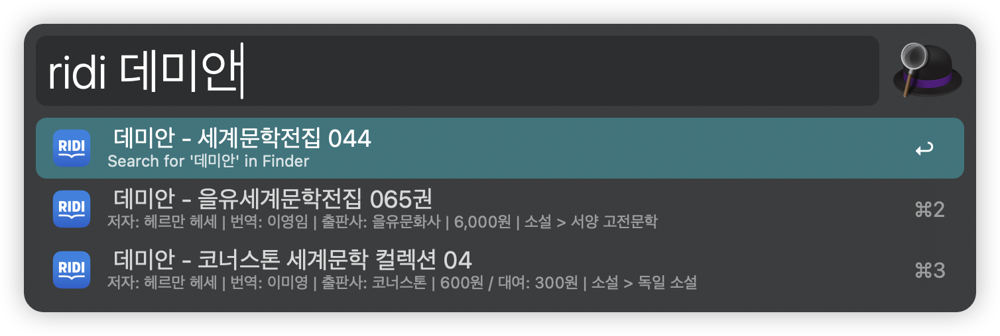

# 리디북스 검색 Alfred 워크플로우

이 Alfred 워크플로우를 사용하면 리디북스(Ridibooks)에서 빠르게 도서를 검색할 수 있습니다.

## 사용 방법

1. Alfred 실행 (기본 단축키: `Option + Space`)
2. `ridi` 키워드 입력
3. 스페이스바 누른 후 검색하고 싶은 도서 제목, 저자 또는 키워드 입력
4. 검색 결과가 나타나면 화살표 키(↑/↓)로 원하는 도서 선택
5. `Enter` 키를 눌러 선택한 도서의 리디북스 페이지로 바로 이동

## 특징

- 실시간으로 리디북스 도서 검색
- 도서 제목, 저자, 출판사, 가격 정보 표시
- 선택한 도서의 상세 페이지로 바로 이동 가능

## 설치 방법

1. [다운로드 링크](https://github.com/seungdols/alfred_ridibooks/releases/download/0.0.1/Search.RIDI.books.alfredworkflow)에서 워크플로우 파일(.alfredworkflow) 다운로드
2. 다운로드한 파일을 더블클릭하여 Alfred에 설치
3. Alfred의 워크플로우 목록에서 설치 확인

## 요구 사항

- Alfred 4 또는 이상 버전
- Alfred Powerpack (유료 버전)

간단한 키워드 입력만으로 리디북스의 방대한 도서 목록을 빠르게 검색해보세요!

